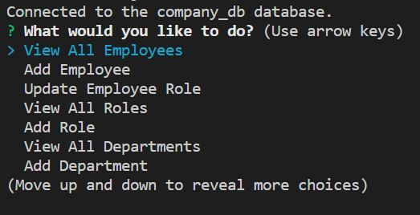
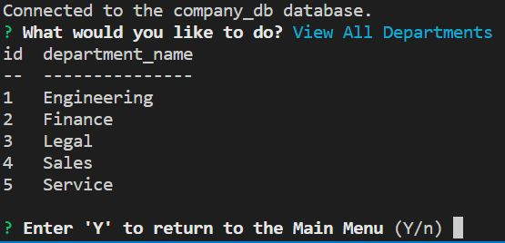
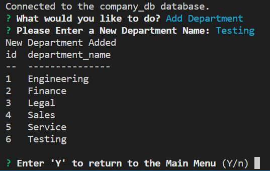
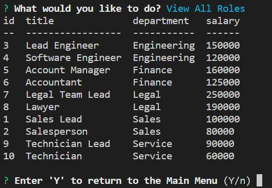
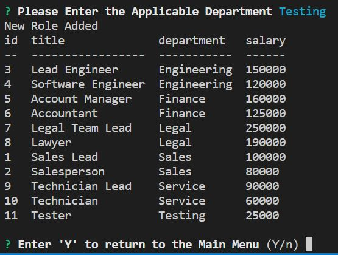
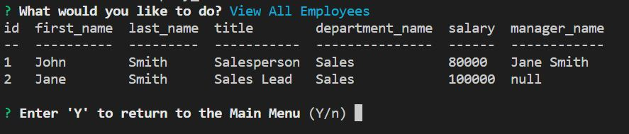
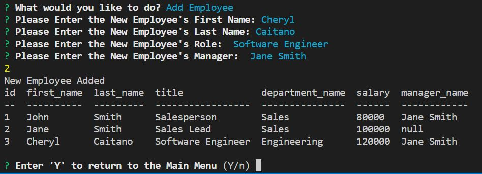
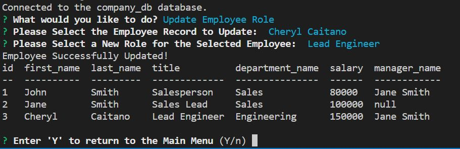

# employee-tracker 📄 - 
View and manage the departments, roles, and employees in a company
## **Description**
The `Employee-Tracker` allows the user to view and add a company's employees, roles, and departments. Users are also able to update existing employee roles.

## **Table of Contents**

- [Installation](#installation)
- [Usage](#usage)
- [License](#license)
- [Technology](#technology)
- [Questions](#questions)

## **Installation**

To install this application, make a `clone` of this repository to your local machine. Open the repository in your code editor of choice 🖥️ 

## **Usage**

Once the repository is cloned to your local machine, then:

Launch from the Terminal:
- Install the required packages by running `npm i` in your applicable terminal
- Run the `schema.sql` and `seeds.sql` in mysql to create and populate existing tables
- Run `node server.js` in your applicable terminal
- Follow the prompts in the terminal to execute desired commands

Employee Tracker Main Menu:

Employee Tracker View Departments:

Employee Tracker Add New Department:

Employee Tracker View Roles:

Employee Tracker Add New Roles:

Employee Tracker View Employees:

Employee Tracker Add New Employee:

Employee Tracker Update Existing Employee:

## **License**

MIT License

Copyright &copy; 2022 Cheryl Caitano

Permission is hereby granted, free of charge, to any person obtaining a copy
of this software and associated documentation files (the "Software"), to deal
in the Software without restriction, including without limitation the rights
to use, copy, modify, merge, publish, distribute, sublicense, and/or sell
copies of the Software, and to permit persons to whom the Software is
furnished to do so, subject to the following conditions:

The above copyright notice and this permission notice shall be included in all
copies or substantial portions of the Software.

THE SOFTWARE IS PROVIDED "AS IS", WITHOUT WARRANTY OF ANY KIND, EXPRESS OR
IMPLIED, INCLUDING BUT NOT LIMITED TO THE WARRANTIES OF MERCHANTABILITY,
FITNESS FOR A PARTICULAR PURPOSE AND NONINFRINGEMENT. IN NO EVENT SHALL THE
AUTHORS OR COPYRIGHT HOLDERS BE LIABLE FOR ANY CLAIM, DAMAGES OR OTHER
LIABILITY, WHETHER IN AN ACTION OF CONTRACT, TORT OR OTHERWISE, ARISING FROM,
OUT OF OR IN CONNECTION WITH THE SOFTWARE OR THE USE OR OTHER DEALINGS IN THE
SOFTWARE.

## **Technology**

- [JavaScript](https://www.javascript.com/) Scripting Language
- [Node](https://nodejs.org/en/) JavaScript runtime
- [npm](https://www.npmjs.com/) Inquirer, Express, UUID, etc.
- [Heroku](https://devcenter.heroku.com/) Cloud Application Platform

## **Questions**

For any questions or contributions please contact me on Github or by e-mail:

[Github Profile](https://www.github.com/ccaitano)  
[Email Me](mailto:cheryl.caitano@gmail.com)